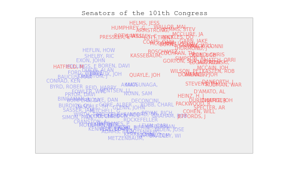
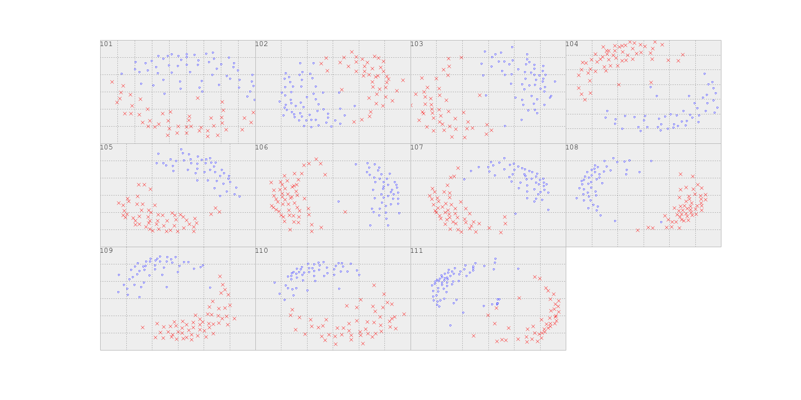

## Dimensionality Reduction for Data Sparsity -- SVD

There are a few techniques to actually perform the PCA reduction.  In this portion of the sprint we will use Singular Value decomposition (SVD) to deconstruct a feature matrix and perform a dimensionality reduction.

We will be using a [book review](http://www2.informatik.uni-freiburg.de/~cziegler/BX/) dataset.  To make the matrix decomposition a little more tractable in the given time, the data files have already been joined and a sample of users and books have been taken.  There are 6100 books and 2500 users in the `data/book_reviews.csv`.  Each row corresponds to a given user's rating of a book.

A common technique for both improving the quality of a recommendation as well as handling sparse data is matrix factorization.  We will be using Singular value decomposition ([SVD](http://en.wikipedia.org/wiki/Singular_value_decomposition)) to factor our reviews matrix.  This has the effect of reducing the dimension of our feature space and also uncovers latent features (similar to the topics from our document clustering): if we are talking about book reviews, latent features might correspond to given genres or styles.

1. Load in the `data/book_reviews.csv` data file to a dataframe.

2. Once the data is loaded we need to transform it into a feature matrix.  Pivot the data such that each row represents a user, and each column (feature) represents their review of that book.  Represent missing data by a value of -1.

#### Step One -- Factor your Matrices!

**SVD**

Let us define:

* __m__: # of users
* __n__: # of items
* __k__: # of latent features (also rank of __A__)

We will be trying to decompose our rating matrix into 3 component matrices:

Where **A** is our user-book rating matrix (__m__ x __n__), **U** is our _weights_ matrix (__m__ x __k__), **S** is our singular values matrix (__k__ x __k__), and **V*** is our features matrix (__k__ x __n__).  The larger the singular value (**S** matrix), the more important that latent feature.  Since **U** and **V** are orthogonal to each other, we can rearrange them in order of decreasing singular values.  If we want to reduce the dimension, we simply set a threshold for which columns/rows to cut off (low rank approximation):

You can think of the weights matrix as representing how much of each latent feature corresponds to each user, and the features matrix as how much of each item/rating contributes to the latent features.

Here is a [picture](images/lecture.jpg) of this topic (drawn by hand).

1. Using numpy's [SVD](http://docs.scipy.org/doc/numpy/reference/generated/numpy.linalg.svd.html) method, decompose our rating matrix into 3 component matrices. 

    Now that we have our component matrices, we would like to inspect the decomposition and determine how many dimensions we should keep.  This is the same process as what we did above for the image dataset with the scree-plot.

2. First calculate the energy that each singular value represents.  Energy is the same as variance of a dimension and we can compute it simply by squaring the singular values.

3.  Total energy is the sum of the energy of each singular value.  Plot the energy of each singular value and look for the 'elbow'.  How many singular values should you keep?

4.  The reason we might be interested in total energy is to have some sense of the information loss of our transformation.  Plot how the total energy varies as you add additional singular values, i.e. plot total energy of SV1, SV1 + SV2, SV1 + SV2 + SV3, etc.  This is equivalent to the cumulative sum of the squares of the singular values.

5.  How many singular values do you need to keep to retain 90% of the total energy?

 --
 
 Now that we have decomposed our matrices, let us try to examine the 'concept/topic' space.  Each row of U connects users to concepts, and each row of V connects books to concepts.  Examine U and V.  

6. Pick a number of Singular values to keep (doesn't have to be as many give 90% total energy).  Look at V to find which books most contribute to each 'topic'.  For each of these 'topics', print out the title and author of the 10 most relevant books.  __Note: You can get the book metadata from the `data/book_meta.csv` file__

7. What does each concept represent?  Can you give them names based on which books comprise them?  

8. Do the same for the users.  How much of each concept does the first user like?

9. You can map a new user into 'concept space' by multiplying by V.  Create a new user (or take an existing one) and map them into 'concept space' by multiplying their rating vector by __V__.  What is their representation in this new space?

We will leave this data set for now, but when we get to recommenders we will already have this exploration and transformation under our belt.

## Visualizing High Dimensional Data

We have touched on many of the issues and treatments of dealing with data that has many dimensions for modeling purposes.  This last section will focus on trying to better understand our data through visualization.  One technique that is often employed to visualize data of arbitrary dimensions is [Multidimensional Scaling](http://en.wikipedia.org/wiki/Multidimensional_scaling) (MDS).  The basic idea of MDS is to compute similarity in an arbitrarily high dimension (the dimension of your original data) and project this into a two dimensional space in a way to preserve distances.  Basically the points in 2-D space should have the same distances between them as they had in the higher dimensional space.

Since we haven't covered MDS we will cleverly use the techniques we already know to get a similar effect.  In this exercise we can use PCA and project our arbitrary dimension data into a number of dimensions we can visually represent (two or three). One classic application of this technique is to visualize voting patterns in the senate.  This is probably so because people love betting on bills like they bet on horse races, but also the senate is a classic example of a partisan 'user base'. We will be working with data from [Vote View](http://www.voteview.com/) and the data dictionary of the structure can be found [here](http://www.voteview.com/senate101.htm).  We will be looking at the Senate votes from the 101-111th senates (1989-2009). Each row of the data corresponds to a single senator and his/her votes for that session of the senate.

Lets see if we can discover anything interesting in the way our senators voted in the 90s!

1.  Load in the data from all of the respective files from `data/senate/*` into a single Dataframe.  To do this you can either iterate over all of the files, or simply first [concatenate](http://www.cyberciti.biz/faq/ubuntu-concatenate-files/) all of the files in a single one. 

2. Now that we have or data in a form that is easy to manipulate we need to convert the voting codes.  They are currently on a more complex 0-9 scale, but we should put them on a Yay (1), Nay (-1), abstain (0) scale.  Map every vote accordingly:
  * 1,2,3 -> 1
  * 4,5,6 -> -1
  * 7,8,9,0 -> 0

4. Using scikit-learn's [PCA](http://scikit-learn.org/stable/auto_examples/decomposition/plot_pca_vs_lda.html) model to project the senate voting data into 2 dimensions by keeping only the first two principle components.

5. Plot our senators in 2-D space.  Start with just points colored blue and red accordingly, but then see if you can instead plot their names so we know who is aligned where.  Any interesting patterns emerge?

 
 
6. Now repeat this for all of the senates in our dataset and track the evolution of partisanship in the Senate!
 

## Extra Credit

1. Instead of awkwardly visualizing our data points as the senators names, we can get the best of both worlds (interpretability and inspection) through interactivity! Using [plotly](https://plot.ly/python/) create the same [scatterplot](https://plot.ly/python/line-and-scatter/#Colored-and-Styled-Scatter-Plot) but with a hover interaction so the senators name (and other info) pops up in the tooltip.  Plotly kinda defaults to this and gives it to us for free.