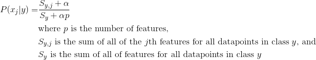
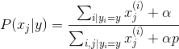
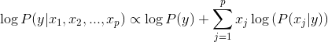

# Implementing Naive Bayes (same as the Lab from 2.1)

We're going to start by implementing Naive Bayes in Python. Rather than using numpy arrays to store everything, we're going to be using python dictionaries. This is especially useful when we are dealing with sparse matrices since we don't need to use up any space for 0 values. It will also enable us to focus on understanding the algorithm rather than focusing on numpy tricks.

### The data

We're going to be using a spam dataset. It's in the [data](data) folder. You can see the feature names [here](https://archive.ics.uci.edu/ml/machine-learning-databases/spambase/spambase.names).

### Naive Bayes Algorithm

Recall that these are the formulas we use for Naive Bayes:

If you prefer it written with math:

And here's how we calculate the probability that the document belongs to a class:

### Test code

You should be able to run your code using the code in `code/run_naive_bayes.py`.

Note that it also runs sklearn's implementation of naive bayes. You should get the same predictions as it does, which you can use to compare your results.

### Implementation

1. Start by looking at the `fit` method. Note that we can use a `Counter` to get the prior probabilities. We don't need to bother dividing by the total number of classes, since they will all be divided by the same number (though we could and it wouldn't change anything).

2. Implement the `_compute_likelihood` method. This is the majority of work we will need to do to train the model.

  * The `class_totals` instance variable should contain the sum of all the features for each class. This is `S_y` from above. The keys should be the classes.

  * The `class_feature_totals` instance variable should contain the sum of each feature for each class. This is a dictionary of dictionaries (technically a defaultdict of Counters). This is `S_yj` from above. You should be able to access this dictionary like this: `class_feature_totals[class y][feature j]`.

  This is in fact all that we need to precompute. We will be doing the Laplace smoothing when we do predictions.

3. Implement the `predict` method. For each row in the feature matrix `X` and for each potential label, you will need to calculate the log likelihood. You should follow the formula from above.

    Then take the class with the largest probability. If you use a `Counter`, you'll be able to use the `most_common` method.

4. Run the code in `run_naive_bayes.py` to verify that you get the same results as sklearn's implementation.