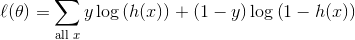
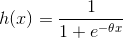
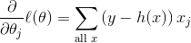
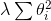
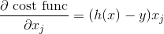

#Gradient Descent/Ascent

We will be implementing logistic regression using the gradient descent algorithm.

####References:####
* [Andrew Ng's Machine Learning Lecture Notes](http://cs229.stanford.edu/notes/cs229-notes1.pdf)

####Notes on Implementing Gradient Descent:####
* Implementing gradient descent can lead to challenging debugging. Try
computing values by hand for a really simple example (1 feature, 2 data points)
and make sure that your methods are getting the same values.
* Numpy is your friend. Use the power of it! There should only be one loop in
your code (in `run`). You should never have to loop over a numpy array. See the
numpy [tutorial](http://wiki.scipy.org/Tentative_NumPy_Tutorial) and
[documentation](http://docs.scipy.org/doc/).

## Part 1: Import Data

For implementing gradient descent, we want to use a simple dataset that's easy to work with.

1. Import 'test_data.csv' into "X" and "y" numpy arrays

    ```python
    data = np.genfromtxt('testdata.csv', delimiter=',')
    X = data[:,0:2]
    y = data[:,2]
    ```
2. We use two features so that we can visualize our data. Make a scatterplot with the first feature on the x axis and the second on the y axis. Differentiate the positive results from the negative results somehow (different colors or different symbols).

3. Just by eye-balling, make an estimate for a good coefficient for this
equation: `y = mx` of the decision boundary. We are using this form since our first implementation will
not find an intercept. But also make an estimate for good coefficients for this
equation: `y = mx+b`.

## Part 2: Cost function

In order to be able to evaluate if our gradient descent algorithm is working
correctly, we will need to be able to calculate the cost.

The cost function we will be using is the *log likelihood*. Our goal will be to *maximize* this value, so we will actually be implementing gradient *ascent*.



Recall that the hypothesis function *h* is defined as follows:



You will also need to have a function which calculates the gradient of the cost function, which is as follows.



1. Compute the result of both the cost function and gradient *by hand* for this example. This will enable you to verify that your implementations are correct. You can of course use a calculator (google/wolfram alpha/python).

    |  x1 |  x2 |   y |
    | --- | --- | --- |
    |   0 |   1 |   1 |
    |   2 |   2 |   0 |

    Set the coefficients = 1 like this: `1 * x_1 + 1 * x_2`

2. In `regression_functions.py`, implement `hypothesis` and `predict` functions. `hypothesis` will calculate the result of `h(x)` for the given coefficients. This returns float values between 0 and 1. `predict` will round these values so that you get a prediction of either 0 or 1. You can assume that the threshold we're using is 0.5.

3. In `regression_functions.py`, implement `log_likelihood` and `log_likelihood_gradient`. You should be able to use the `hypothesis` function you implemented above. Make sure to check that you get the same values as you computed above.

    In a terminal, you should be able to run your function like this:

    ```python
    import regression_functions as f
    import numpy as np
    X = np.array([[0, 1], [2, 2]])
    y = np.array([1, 0])
    coeffs = np.array([1, 1])
    f.log_likelihood(X, y, coeffs)
    ```

    Make sure to do `reload(f)` if you make changes to your code.

## Part 3: Implement Gradient Ascent

Now are are going to implement gradient ascent, an algorithm for solving
optimization problems.

Below is psuedocode for the gradient ascent algorithm. This is a generic
algorithm that can solve a plethora of optimization problems.
In our case, *b* we are solving for is the coefficient vector in
*y = Xb*. We will initialize it to be all zeros.

In this pseudocode and in our implementation, we will stop after a given number
of iterations. Another valid approach is to stop once the incremental
improvement in the optimization function is sufficiently small.

    Gradient Ascent:
        input: J: differential function (optimization function)
               alpha: learning rate
               n: number of iterations
        output: local maximum of optimization function J

        initialize b (often as all 0's)
        repeat for n iterations:
            update b as b + alpha * gradient(J)

You are going to be completing the code stub in `gradient_ascent.py`.

1. Start by taking a look at the starter code. Note how the `GradientAscent` object is initialized. It takes a cost function and a gradient function. We will pass it the functions that we wrote above. Here's example code of how we'll be able to run the Gradient Ascent code.

    ```python
    from regression_functions import log_likelihood, log_likelihood_gradient
    gd = GradientAscent(log_likelihood, log_likelihood_gradient, predict)
    gd.run(X, y)
    print "coeffs:", gd.coeffs
    predictions = gd.predict(X)
    ```

2. Implement the `run` method. Follow the pseudocode from above.

3. Implement the `predict` method. It should just call the `predict` function that was taken as a parameter.

    This will be a kind of boring function. But later it will get more interesting if we do any preprocessing on the data.

## Part 4: Run gradient ascent & compare

Now we're ready to try out our gradient ascent algorithm on some real data.

1. Run your version of gradient ascent on the fake data you created at the beginning.

    **Note:** If you're having trouble getting it to converge, run it for just
    a few iterations and print out the cost at each iteration. The value should
    be going down. If it isn't, you might need to decrease your learning rate.
    And of course check your implementation to make sure it's correct. You can
    also try printing out the cost every 100 iterations if you want to run it
    longer and not get an insane amount of printing.

2. Do you get coefficient values similar to your prediction?

3. Run sklearn's `LogisticRegression` on the fake data and see if you get the same results.

## Part 5: Add Intercept

Ideally we would like to also have an intercept. In the one feature case, our equation
should look like this: `y = mx + b` (not just `y = mx`). We solve this by adding
a column of ones to our feature matrix.

1. Implement `add_intercept` in
`linear_regression_functions.py` and use it to modify your feature matrix
before running gradient ascent.

    ```python
    def add_intercept(X):
        '''
        INPUT: 2 dimensional numpy array
        OUTPUT: 2 dimensional numpy array

        Return a new 2d array with a column of ones added as the first
        column of X.
        '''
    ```

2. Modify the `__init__` method of `GradientAscent` so that it can take a boolean parameter `fit_intercept`:
    
    ```python
    def __init__(self, cost, gradient, fit_intercept=True):
        # code goes here
    ```
    
    If you set `add_intercept` to be False, it should work the same way as before this modification.

3. Check that you get a similar result to your prediction.

## Part 6: Scaling

If you try running your gradient ascent code on some of the data from yesterday, you'll probably have issues with it converging. You can try playing around with alpha, the learning rate (one option is to decrease the
learning rate at every iteration).

An easier way is to *scale* the data.
Basically, we shift the data so that the mean is 0 and the standard deviation
is 1. To do this, we compute the mean and standard deviation for each feature
in the data set and then update the feature matrix by subtracting each value
by the mean and then dividing by the standard deviation.

1. Commit your code! Run a `git commit -m "some message"` so that if you goof
things up with your changes you don't lose your previous version.

2. Add the some methods to the `GradientAscent` class to calculate the scale factors and to scale the features (if the parameter is set.
    * **Note:** Make sure to scale before you add the intercept column. You don't want to try and scale a column of all ones.

3. Modify the `__init__` method of the `GradientAscent` class so that it can take a boolean `scale` parameter. Add calls of the above functions to the `run` method if `scale` is `True`.

4. Make sure to scale the features before you call the `log_likelihood` or `log_likelihood_gradient` function.

    * **Note:** You should calculate mu and sigma from the *training* data and use those values of mu and sigma to scale your test data (that would result in dividing by 0).

5. Run your code on the fake data and make sure you get the same results.

6. Try running your code on the data from yesterday. Does it converge?

## Part 7: Termination

We can instead of terminating after a fixed number of iterations, we can terminate when the incremental improvement in the cost function is sufficiently small.

1. Add a parameter `step_size` to the `run` function. Terminate the loop once the incremental decrease in the cost function is smaller than `step_size`. Note that this means you'll have to evaluate the cost function at each iteration and compare it to the previous value of the cost function. Specify your function to rely on the step_size parameter instead of the num_iterations parameter if the step_size
is not None.

2. Figure out what a good value for the `step_size`. If it's too large, you won't make it to the optimal solution. If it's too small, it will take too long to converge.

## Extra Credit

### Regularization

Recall that regularization helps us deal with overfitting. Let's implement L2 regularization (Ridge).

We will be subtracting the following term to the likelihood function.



1. Again, don't forget to commit first!

2. Modify your log likelihood to include the above term.

3. Modify your log likelihood gradient function to include the gradient of the above term.

4. When you instantiate the `GradientAscent` object, you will need to use a new version of these two functions. Here's how you can create them:

    ```python
    likelihood_regularized = lambda X, y, coeffs: \
                             log_likelihood(X, y, coeffs, l=1)
    gradient_regularized = lambda X, y, coeffs: \
                           log_likelihood_gradient(X, y, coeffs, l=1)
    ```

    Note that you won't actually need to modify your `GradientAscent` algorithm at all.


***Always commit before you start a new part! If you muck up your previously working solution, you'll want to get back to it!***

### Stochastic Gradient Descent

*Stochastic Gradient Descent* is a variant of the gradient descent algorithm that in practice converges faster. The difference is that at each iteration, stochastic gradient descent only uses *one* training example for its update. Here is the pseudocode. `n` here is the number of training examples.

```
Randomly shuffle examples in the training set.
Repeat until step size is sufficiently small:
    for i = 1, 2, ... n:
        coeffs <- coeffs - alpha * gradient for training example i
```

Here is the gradient formula to be used for updating a coefficient for a single data point:



Note that we shuffle the training examples and then go through them in order so that we use every training example before repeating.

1. Implement stochastic gradient descent. Make sure to save the old version of gradient descent so that we can compare them.

2. Use ipython's `timeit` to compare the runtime of the standard gradient descent algorithm and stochastic gradient descent. Also compare their results to verify that their performance is the same.

### Newton's Method for a single variable
While gradient descent and stochastic gradient descent are two of the most common optimization techniques, they are not the only techniques often used by data scientists. Another commonly used method is called Newton's Method, which can be used to find local optima any twice-differentiable function, such as the log-likehihood function. 

As you learned in calculus, one way to optimize a function is by setting its derivative equal to zero. Newton's Method approximates the zeros of a function's derivative. In this exercise, we will use Newton's Method to optimize the value of a function over a single variable.

Newton's Method searches for the zero of f' until f' is sufficiently small, i.e. below a prefined tolerance. 

This is Newton's Method's procedure, as applied to a single-variable function f, which is the function we want to optimize:


    1. Provide an initial guess x0 for the location of the optimum.
    2. Calculate f'(x0)
    3. If f'(x0) is less than your pre-defined tolerance, then stop. Otherwise continue.
    4. Find the x-intercept of the line tangent to f' at x0.
    5. Update x0 := the x-intercept found in step 4.
    6. Return to step 2.

You can see a visualization of Newton's Method in this [video](https://www.youtube.com/watch?v=x2KbdoxrQ6o).

1. Write an equation for the update step: x0 := x0 + ____

2. Write a function that takes as arguments (1) the function f you want to optimize, (2) f', (3) f'', and (4) the tolerance, and returns the optimal x and f(x)

3. Test your function to minimize f(x) = 6x^2 + 3x - 10 